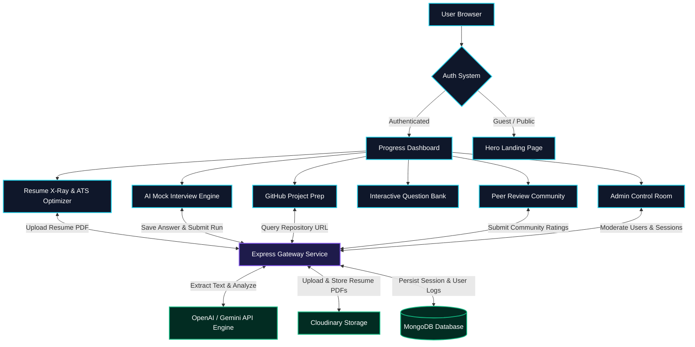

# <div align="center">⚡ InterviewOS - Frontend Placement Co-Pilot⚡</div>

<div align="center">
  <p>A production-grade, highly interactive, and visually stunning web workspace built for final-year CS students and placement aspirants. It coordinates AI-driven resume optimization, real-time mock interviews, GitHub repository analyzers, and community review networks into a unified dashboard experience.</p>
</div>

---

<div align="center">

[](https://react.dev)
[](https://www.typescriptlang.org)
[](https://tailwindcss.com)
[](https://redux-toolkit.js.org)
[](https://www.framer.com/motion/)
[](https://vite.dev)

</div>

---

## 🗺️ Application Workflow & Architecture

Below is the user journey roadmap and integration architecture. It illustrates how the frontend coordinates client states with the Express backend, AI services, and community databases.



---

## ✨ Primary Workspace Modules

### 🔐 1. Authentication System
* **Complete Registration & Login:** Full validation powered by React Hook Form & Zod with client-side indicators for password strength and character matches.
* **Social OAuth Ready:** Built-in hooks and components for Google and GitHub authentication integrations.
* **Persistent Sessions:** Protected routing wrappers block unauthorized access, utilizing Redux storage to restore sessions instantly on reload.

### 📊 2. Main Progress Dashboard
* **Dynamic Analytics:** Real-time state cards showing ATS scores, solved questions count, mock runs, and average competencies.
* **Progress Graphs:** Area charts displaying performance scores trends over time, custom skills radar charts, and interactive activity feeds.
* **Action Center:** Action buttons to jump to immediate preparation steps, alongside upcoming tasks prioritizations.

### 📄 3. Resume X-Ray (ATS Optimizer)
* **Drag-and-Drop Uploader:** Fully animated file-upload interface supporting PDF and doc files.
* **AI Strategy Report:** Renders overall ATS matching scores, key technical strengths, detailed weaknesses, missing stack skills, and keyword additions/removals.
* **Custom Roadmaps:** Provides recommended target projects and a structured study plan.

### 🎤 4. AI Mock Interview Engine (Text-Based)
* **Immersive Session Room:** Simulation page with virtual audio/video settings, countdown clocks, progress trackers, and hints drawer.
* **Real-time Evaluator:** Multi-turn practice runs, compiling textual answers directly to the backend for scoring.
* **Evaluation Reports (`/mock-interview/report/:id`):** Beautiful breakdown cards showing score per question, core strengths, weaknesses, and model answers.
* **Performance Analytics (`/mock-interview/analytics`):** Detailed area/line score progress trend, radar competency logs (communication, accuracy, structure, etc.), and distribution charts.
* **Interview History (`/mock-interview/history`):** Complete historical logs of past mock runs with search queries, difficulty filters, and scores.

### 🚀 5. GitHub Project Prep
* **Repository Analyzer:** Input any public GitHub URL to extract repository structures and file configurations.
* **Tailored Question Bank:** Dynamically generates interview questions customized for the project's exact technology stack and software design patterns.

### 👥 6. Peer Review Network
* **Community Board:** Upload resumes, view feedback from peers, rate layouts out of 5 stars, and read comments.
* **Interactive Engagement:** Threads supporting like counters, replies, and community helper badges.

### 🛡️ 7. Admin Control Room (`/admin`)
* **Dashboard Overview:** Displays platform metrics (total users, active sessions, resume documents, and interviews completed).
* **User Management:** Live lookup and search features with account lockouts, user deletions, and activation updates.
* **Session Monitor:** Terminates running sessions, audits user IP locations, and reviews active client devices.
* **Moderation Queue:** Approve or reject community submissions in real-time.

---

## 🛠️ Complete Technology Stack

| Library / Module | Purpose in Platform | Accent Badge |
| :--- | :--- | :--- |
| **React 18.2.0** | Component Architecture & Mounting | `UI Foundation` |
| **TypeScript 5.3.0** | Static Type Safety & Compile Validation | `Strict Types` |
| **Tailwind CSS 3.4.0** | Utility Styling, Dark Themes & Breakpoints | `Theme & Style` |
| **Redux Toolkit 2.2.0** | Auth Sessions, Resume State, & Store Hooks | `State Management` |
| **React Router DOM 6.22** | Navigation Layouts, Dynamic Routing, & Protection | `Routing Client` |
| **Framer Motion 11.0.0** | Dynamic Page Transitions & UI Micro-Animations | `Transitions` |
| **Recharts 2.12.0** | Area Charts, Skill Radar, & Analytics Visualizations | `Data Viz` |
| **Lucide React 0.344** | SVG Icon Packs & Action Graphics | `Vector Icons` |
| **Axios 1.16.1** | Configured HTTP Request Client with Interceptors | `API Client` |
| **Zod & React Hook Form** | Form Inputs Parsing & Validation Safeguards | `Validation` |

---

## 📁 Project Directory Structure

```yaml
interview-project/Fronted/
├── dist/                     # Optimized compilation distribution output
├── docs/                     # Platform architecture guides & summaries
├── public/                   # Static site icons & configurations
├── src/
│   ├── assets/               # Local images & visual assets
│   ├── components/           # Reusable interactive components
│   │   ├── ConfirmDialog.tsx # Global confirm prompt wrapper
│   │   └── Layout/           # Modular frame elements
│   ├── context/              # Central state store config
│   │   ├── index.ts          # Redux Store entrypoint
│   │   └── slices/           # State slices (userSlice, resumeSlice)
│   ├── hooks/                # Custom React hook logic (useInterview, useAuth)
│   ├── layouts/              # Shared dashboard layouts & sidebar structures
│   ├── lib/                  # Central helper files
│   ├── pages/                # App page route views
│   │   ├── Admin.tsx         # Dashboard administration control panel
│   │   ├── Dashboard.tsx     # Student home hub page
│   │   ├── InterviewAnalytics.tsx # Performance metrics, radars, & graphs
│   │   ├── InterviewHistory.tsx # List of past mock interview sessions
│   │   ├── InterviewResult.tsx # ATS Optimization reports view
│   │   ├── LandingPage.tsx   # Marketing page
│   │   ├── MockInterview.tsx # Interview question room
│   │   ├── MockInterviewReport.tsx # Post-interview scores & model answers
│   │   ├── PeerReview.tsx    # Resume feedback board
│   │   ├── ProjectPrep.tsx   # GitHub tech stack question builder
│   │   ├── QuestionBank.tsx  # Company filter questions
│   │   ├── SignIn.tsx        # Login page
│   │   └── SignUp.tsx        # Registration page
│   ├── routes/               # Navigation routers & protections
│   ├── services/             # API clients (api.ts, mockInterview.service.ts)
│   ├── styles/               # Main styles (index.css)
│   ├── utils/                # Date parsers & common utilities
│   ├── App.tsx               # Primary router mounting
│   └── main.tsx              # Index mount entrypoint
├── package.json              # Main dependencies config
├── tailwind.config.js        # Theme color palettes & animations
└── tsconfig.json             # TypeScript rules definition
```

---

## 🎨 Styling & Brand Identity

The workspace uses a modern, dark-theme layout with distinct neon accents to highlight features:

* **Theme Colors:**
  * `Primary Dark Background` -> `#0B0F19` (Deeper space-cadet navy)
  * `Secondary Dark Background` -> `#111827` (Card panels)
  * `Cyan Accent` -> `#22D3EE` (Primary interaction actions & selections)
  * `Purple Accent` -> `#8B5CF6` (Secondary accents & Admin labels)
  * `Green Accent` -> `#10B981` (High score indicators)
  * `Warning Yellow` -> `#FACC15` (Warning state warnings)
  * `Special Pink` -> `#F472B6` (Call-to-Action badges & weak areas highlighting)

* **Tailwind Animations:**
  * `glow 2s infinite` -> Pulsing accent shadow shadows.
  * `float 3s infinite` -> Levitating UI containers for high priority tips.
  * `slide-up 0.5s` -> Smooth page transition animation on loading components.

---

## 🚀 Development Quickstart

### Prerequisites
* **Node.js:** `v18.0.0` or higher
* **npm:** `v9.0.0` or higher

### Installation

1. **Get the code:**
   ```bash
   git clone https://github.com/your-repo/interviewos.git
   cd interviewos/Fronted
   ```

2. **Install project dependencies:**
   ```bash
   npm install
   ```

3. **Configure Environment Variables:**
   Create a `.env` file in the root of the `Fronted/` directory:
   ```env
   VITE_API_BASE_URL=http://localhost:5000/api
   ```

4. **Launch development server:**
   ```bash
   npm run dev
   ```
   Navigate to `http://localhost:5173` inside your browser.

---

## 📦 Building & Production Deployment

To generate optimized distribution assets for hosting:

```bash
# Compile and build the files
npm run build

# Preview the built distribution locally
npm run preview
```

The compiled output will be generated under `/dist`, optimized with automatic code-splitting, module tree-shaking, and minification strategies.
